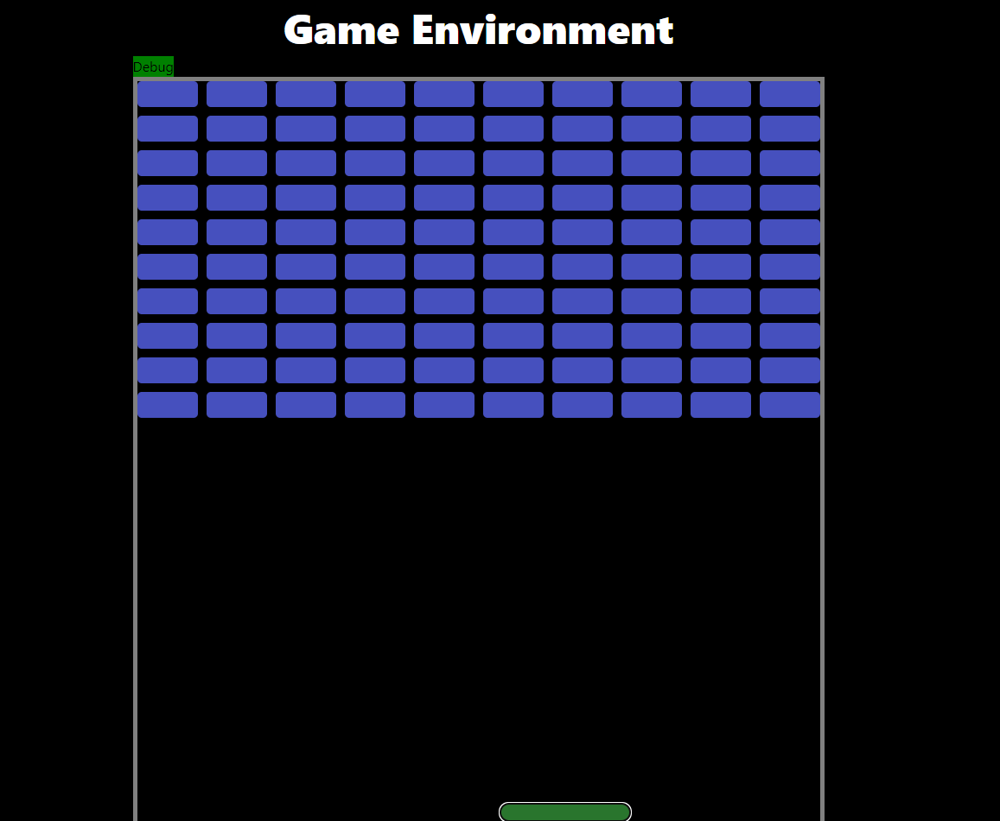

# Breakout_Web

Welcome to Breakout_Web! This is a simple breakout game developed using Blazor.

## Game Environment



## About

Breakout_Web is a classic arcade game where you control a paddle to hit a ball and break bricks. The game was created using Blazor, a framework for building interactive web applications with .NET.

## How to Play

1. Use the left and right arrow keys to move the paddle.
2. Prevent the ball from falling off the screen by bouncing it with the paddle.
3. Break all the bricks to advance to the next level.

## Installation

To run the game locally, follow these steps:

1. Clone the repository:
    ```sh
    git clone https://github.com/yourusername/Breakout_Web.git
    ```
2. Navigate to the project directory:
    ```sh
    cd Breakout_Web
    ```
3. Build and run the project:
    ```sh
    dotnet run
    ```

## Contributing

Contributions are welcome! Please fork the repository and submit a pull request.

## License

This project is licensed under the MIT License.

Enjoy the game!